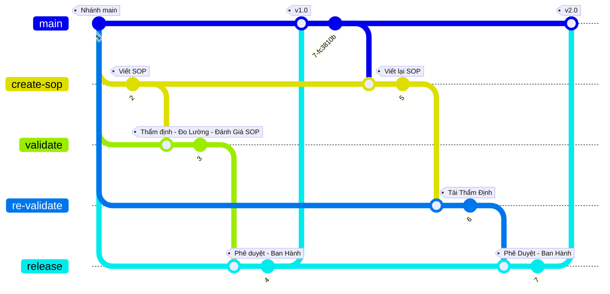
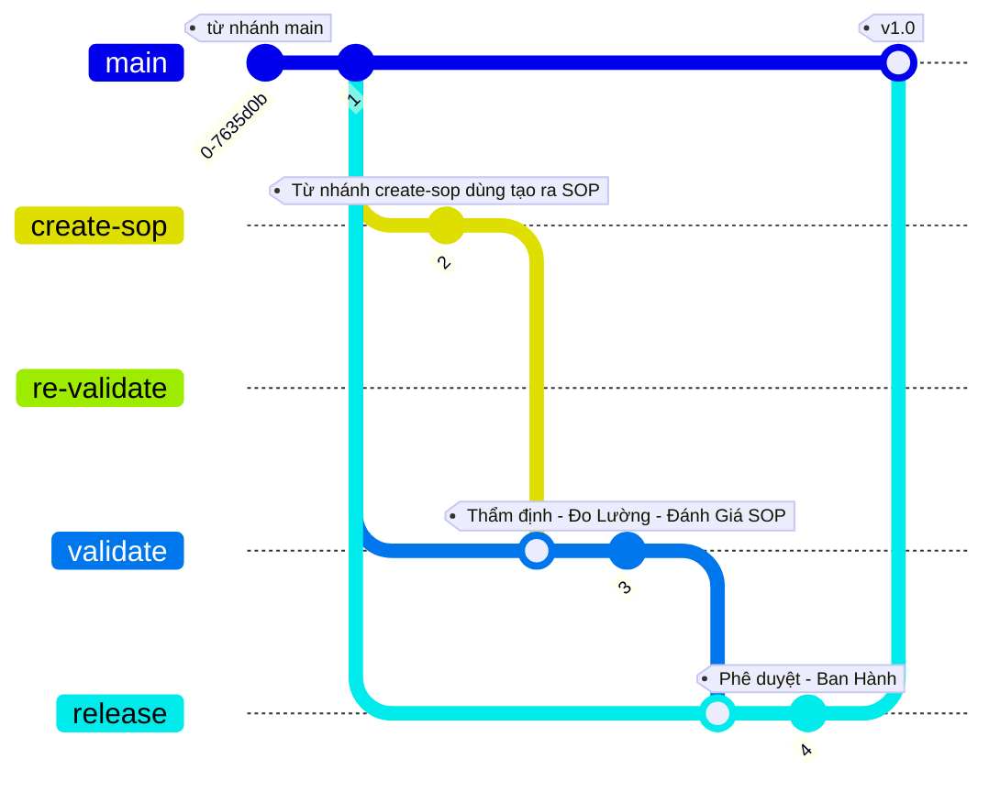
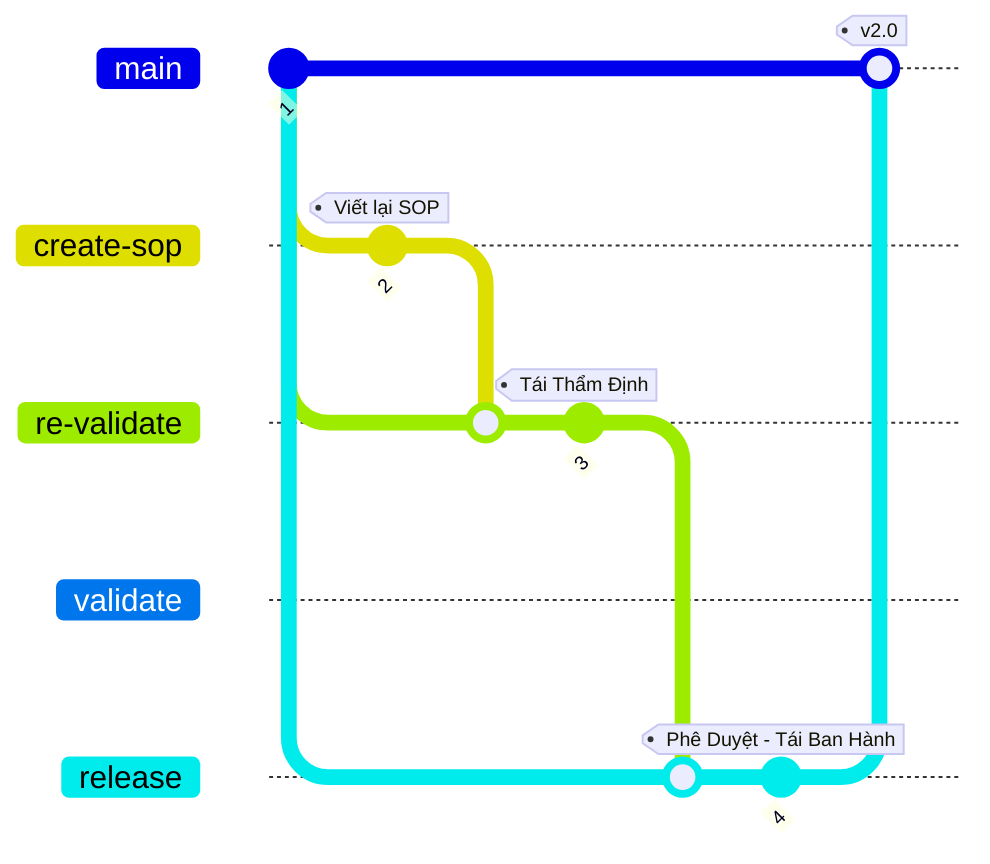

# SOP Management System

- Workflow Tổng Quan

```mermaid

---
title:
---

gitGraph
   commit id: "1" tag: "Nhánh main"
   branch create-sop
   branch validate
   branch re-validate
   branch release

   checkout create-sop
   commit id: "2" tag: "Viết SOP"

   checkout validate
   merge create-sop
   commit id: "3" tag: "Thẩm định - Đo Lường - Đánh Giá SOP"

   checkout release
   merge validate
   commit  id: "4" tag: "Phê duyệt - Ban Hành"
   checkout main
   merge release tag: "v1.0"
   commit

   checkout create-sop
   merge main
   commit id:"5" tag: "Viết lại SOP"

   checkout re-validate
   merge create-sop
   commit id:"6" tag:"Tái Thẩm Định"

   checkout release
   merge re-validate
   commit id:"7" tag:"Phê Duyệt - Ban Hành"

   checkout main
   merge release tag:"v2.0"

```

- Qui trình tạo SOP - Thẩm Định - Ban Hành

```mermaid
---
title:
---

gitGraph
   commit tag: "từ nhánh main"
   commit id: "1"
   branch create-sop
   branch re-validate
   branch validate
   branch release

   checkout create-sop
   commit id: "2" tag: "Từ nhánh create-sop dùng tạo ra SOP"

   checkout validate
   merge create-sop
   commit id: "3" tag: "Thẩm định - Đo Lường - Đánh Giá SOP"

   checkout release
   merge validate
   commit  id: "4" tag: "Phê duyệt - Ban Hành"
   checkout main
   merge release tag: "v1.0"


```

- Qui trình Tái Thẩm Định - Ban Hành

```mermaid
---
title:
---

gitGraph
   commit id: "1"
   branch create-sop
   branch re-validate
   branch validate
   branch release


   checkout create-sop
   commit id: "2" tag:"Viết lại SOP"

   checkout re-validate
   merge create-sop
   commit id: "3" tag: "Tái Thẩm Định"

   checkout release
   merge re-validate
   commit id: "4" tag:"Phê Duyệt - Tái Ban Hành"
   checkout main
   merge release tag: "v2.0"


```
